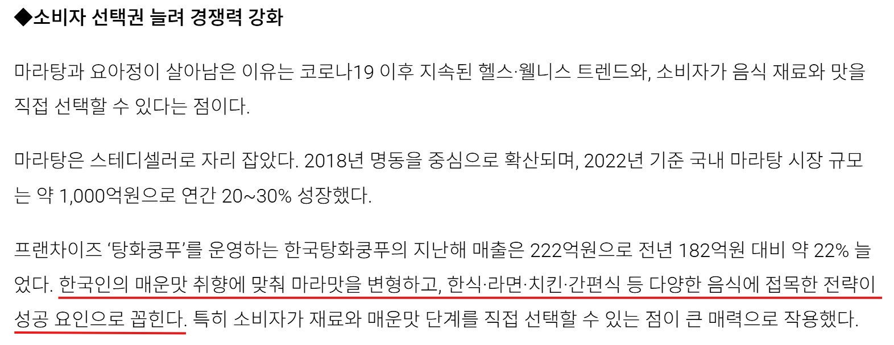
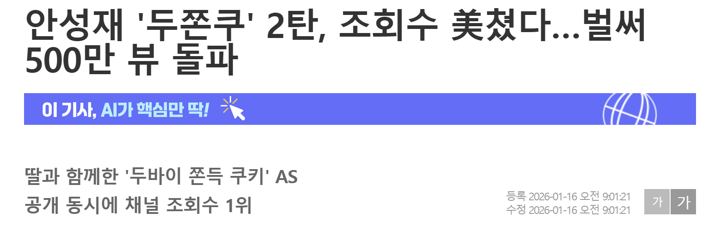
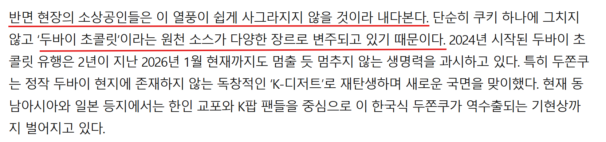
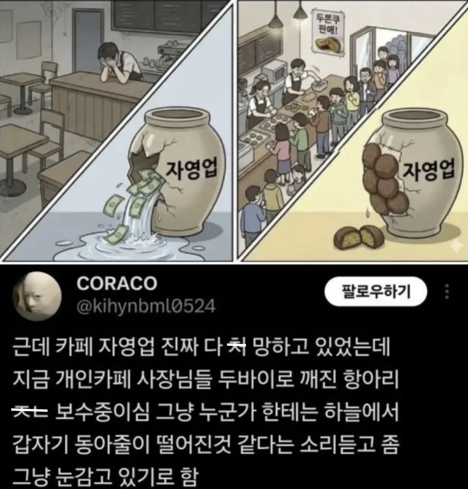

# 4. 데이터 분석 및 핵심 기능 (Analysis & Features)

## 4.1 핵심 발견 1: 두바이 쫀득 쿠키(두쫀쿠) 가격 전략 및 수익성 인사이트
재료비와 인건비 분석을 통해 산출된 적정 판매가 및 수익 가이드라인입니다.

### [원가 분석 결과]
- **개당 총 원가**: **약 6,125원 ~ 6,625원**
  - **재료비**: 약 4,125원 (피스타치오 약 122% 상승 반영)
  - **인건비**: 약 2,000원 ~ 2,500원 (6단계의 복잡한 공정 포함)
- **임계점**: 판매가가 8,000원 미만일 경우 고정비(카페 유지비) 제외 시에도 마진이 매우 낮거나 적자가 발생할 위험이 큼.

### [판매 전략 및 수익성 진단]
| 판매가 | 마진율 | 현실성 및 판단 | 권장 전략 |
| :---: | :---: | :--- | :--- |
| **8,000원** | 낮음 | 월 2,134개 판매 필요 (하루 86개) | 초기 진입 시 공격적인 홍보용 가격 |
| **9,000원** | **안정적** | 월 1,392개 판매 필요 (하루 56개) | **가장 현실적인 도전 가능 가격** |
| **10,000원** | **최고** | 월 1,033개 판매 필요 (하루 42개) | 프리미엄 포지셔닝 및 수익 극대화 전략 |

---

## 4.2 핵심 발견 2: 트렌드 지속성 분석
*(이 항목은 데이터 업데이트 후 추가 분석 예정이며, 현재 수집된 지표의 특징은 다음과 같습니다.)*

- **네이버 블로그 포스팅 추이**: 과거 유행 사례(포켓몬빵, 탕후루)와 현재 두쫀쿠의 포스팅 빈도를 비교 분석.

- **유튜브 관심도 지표**: 두바이 쿠키 관련 영상의 조회수, 좋아요, 댓글 참여도를 통한 트렌드 확인.

---

## 4.3 분석 데이터 근거 및 시장 사례
트렌드의 지속성 및 바이럴 효과를 뒷받침하는 데이터 근거 자료입니다.

### A. 스테디 트렌드 및 바이럴 사례
- **마라탕 사례**: 일시적 유행을 넘어 하나의 식사 카테고리로 안착한 배경 분석.

[관련 기사 보기](https://www.srtimes.kr/news/articleView.html?idxno=183665)

- **안성재 쉐프 유튜브 바이럴**: 업로드 15일 만에 500만 뷰를 돌파하며 강력한 대중적 관심도 증명.

[관련 기사 보기](https://www.edaily.co.kr/News/Read?newsId=02650246645318376&mediaCodeNo=257)

### B. 시장 확장성 및 변형 상품 등장
- **다양한 형태의 상품화**: 김밥, 케이크, 찐빵 등 타 카테고리로의 변형을 통한 유행 지속력 확보.

[관련 기사 보기](https://www.newsis.com/view/NISX20260113_0003474578)

- **타 업종 진입**: 베이커리를 넘어 다양한 채널에서 광고 및 집객용 상품으로 활용 중.

[관련 기사 보기](https://www.munhwa.com/article/11560229?ref=naver)

---

## 4.4 비즈니스 임팩트: 소상공인을 위한 인사이트
두바이 쿠키 트렌드가 일시적인 유행에 그치지 않고, 마라탕과 같이 장기적으로 안착할 가능성이 높다고 판단하였습니다. 이러한 **지속적인 시장 수요 전망**을 바탕으로 소상공인들이 실전에서 활용할 수 있는 핵심 인사이트와 판매 전략을 다음과 같이 제안합니다.

1.  **적게 팔아도 확실하게 남는 '프리미엄 전략'**: 
    - 트렌드가 계속될 때는 가격이 조금 비싸더라도 '제대로 된 맛'을 찾는 손님이 많습니다. 원재료값을 무리하게 아끼기보다 **9,000원~10,000원대 가격**을 지켜서 브랜드 가치를 높여야 합니다.
    - 이렇게 하면 많이 팔지 못하더라도 하나를 팔 때마다 이익이 충분히 남기 때문에, 가게 운영비를 충당하고 사장님의 노동력을 아끼는 실질적인 생존 방식이 됩니다.

2.  **질리지 않게 변신하는 '새로운 디저트 메뉴'**: 
    - 단순히 쿠키 하나에만 매달리지 말고 케이크, 찐빵, 마카롱 등 **두바이 스타일을 입힌 다양한 디저트**로 메뉴를 계속 넓혀가야 합니다.
    - 새로운 형태의 메뉴가 계속 나오면 손님들은 유행이 지났다고 느끼지 않고 계속 궁금해하며 가게를 다시 찾게 됩니다.

3.  **손님을 가게로 불러모으는 '효자 상품' 역할**: 
    - 두쫀쿠는 그 자체로 돈이 될 뿐만 아니라, 이 메뉴를 먹으러 손님이 가게를 찾아오게 만드는 강력한 홍보 수단이 됩니다.
    - 쿠키를 사러 온 손님이 커피나 다른 빵도 함께 구매하는 '낙수 효과'가 생기면서, 가게 전체 매출을 끌어올리는 든든한 역할을 해줍니다.

[관련 기사 보기](https://magazine.hankyung.com/business/article/202601151496b)
