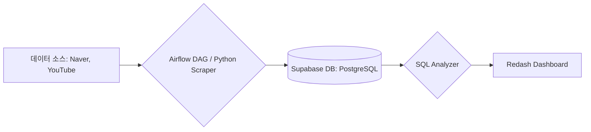

# 자유 주제 캡스톤 프로젝트 주제 선정안

## 1. 프로젝트 기본 정보

*   **팀명**: 두쫀핑
*   **프로젝트명**: 두바이 쫀득 쿠키의 시장성과 수익성을 분석하기 위한 데이터 기반 비즈니스 인사이트 도출
*   **팀원**: 박지원, 배승재
*   **진행 기간**: 2026년 1월 14일(수) ~ 1월 16일(금) (3일)

---

## 2. 문제 정의 (Why)

### 과거 유행 사례의 교훈
F&B 시장은 폭발적인 유행 뒤에 급격한 쇠퇴가 뒤따르는 **'반짝 유행(Fad)'**과 일상적인 메뉴로 자리 잡는 **'지속 가능한 트렌드(Trend)'**의 역사가 공존함.
*   **반짝 유행 사례 (포켓몬빵, 탕후루)**: 특정 시기에 폭발적인 구매 열풍과 오픈런 현상을 일으켰으나, 일정 시간이 지난 후 관심도가 급격히 하락하여 현재는 찾아보기 힘든 일시적인 유행의 대표 사례.
*   **지속 가능 트렌드 사례 (마라탕, 마라샹궈)**: 도입 초기에는 생소한 유행으로 시작했으나, 점차 대중 문화에 깊숙이 자리 잡아 유행이 지난 후에도 식지 않고 하나의 디저트/식사 카테고리로 안착함.
*   **공통점 및 분석 포인트**: '두바이 쫀득 쿠키' 역시 현재 두 사례와 비슷한 양상을 띄며 시장에 대거 진입하고 있으나, 이것이 포켓몬빵처럼 반짝 유행으로 끝날지 아니면 마라 관련 상품처럼 지속될지에 대한 분석이 절실한 상황임.

### 해결하고자 하는 문제
원자재값 폭등(피스타치오 약 122%↑) 상황에서 객관적인 지표 없이 '감'에 의존한 메뉴 도입 및 가격 책정으로 인해 발생하는 소상공인의 경영 리스크 해결.

### 중요성 및 목적
소상공인이 신메뉴 도입 및 시장 진입 여부를 객관적으로 판단할 수 있도록 간이 수익 구조(마진율) 분석을 제공하고, 일시적인 유행(Fad)과 지속 가능한 트렌드(Trend)를 구분할 수 있는 데이터 기반의 의사결정 근거를 마련함.

### 타겟 사용자
*   **예비 창업자**: 메뉴 도입 여부 및 적정 판매가를 고민 중인 예비 사장님.
*   **현재 운영자**: 인상된 원재료비에 맞춰 수익 구조를 재설계하려는 자영업자.

### 핵심 질문 (Key Questions)
1. 원자재 쇼크에도 불구하고 소비자의 실제 맛 만족도와 재방문 의사는 긍정적으로 유지되고 있는가?
2. 유튜브 도입기(2025년 11월) 대비 현재(26년 1월)의 댓글 수, 좋아요 수, 조회수, 일별 영상 업로드 수 변화를 통해 트렌드가 하락세에 접어들었는지 판단할 수 있는가?
3. **과거 유행 사례(포켓몬빵 vs 마라탕/마라샹궈)의 온라인 관심도 추이와 비교했을 때, 두바이 쫀득 쿠키의 현재 위치는 어디인가?**

---

## 3. 데이터 소스 (Data Sources)

*   **수집 출처**: 네이버 블로그 검색 포스트량 조사(두쫀쿠, 포켓몬빵, 마라탕, 마라샹궈 , 탕후루), 두쫀쿠 제작에 필요한 원재료인 피스타치오, 초콜릿, 밀가루, 버터 등 쇼핑몰 원자재 가격 정보, 유튜브 데이터 API (v3), 국제 원자재 시세 보도자료.
*   **수집 주기**: 프로젝트 기간 내 배치(Batch) 수집 및 분석.
*   **데이터 볼륨**: 네이버 블로그 두쫀쿠 및 **과거 유행 키워드(포켓몬빵, 마라탕, 마라샹궈 , 탕후루)** 포스트 업로드량, 두쫀쿠 관련 유튜브 키워드 업로드량 및 일별 조회수, 댓글 수, 좋아요 수.
*   **파일 형식**: PostgreSQL (Supabase)

---

## 4. 아키텍처 설계

### 데이터 파이프라인

### 시스템 구조
**[데이터 소스]** (Naver, YouTube)

↓ (Airflow DAG: 가상환경 배치 실행 및 전처리)

**[Supabase DB]** (PostgreSQL 정형 데이터 적재)

↓ (SQL 쿼리: 지표 가공 및 관심도 지수 산출)

**[Redash 대시보드]** (실시간 시각화 및 트렌드 분석)

### 상세 설계
*   **Airflow DAG 스케줄**: 
    - `daily_trends_dag`: 유튜브 데이터 수집 및 업데이트.
    - `naver_blog_crawler_dag`: 네이버 블로그 트렌드 수집.
    - 네이버 및 유튜브에서 '매일 새로 발생한 데이터'를 중복 없이 수집 (증분 추출).
*   **데이터 적재 테이블 구조**:
    - `daily_trends` (YouTube): `date`, `keyword`, `video_count`, `total_views`, `total_likes`, `total_comments`.
    - `naver_blog_trends` (Naver): `date`, `keyword`, `total_count`.
*   **분석 및 시각화 로직**:
    1. **지속/반짝 유행 비교**: '마라탕(지속)'과 '포켓몬빵,탕후루(반짝)'의 블로그 포스팅 추이 그래프를 먼저 제시하여 트렌드 유형별 전형적인 패턴을 정의함.
    2. **두바이 쫀득 쿠키 수익성 분석**: 원재료비 폭등 상황을 반영하여 마진율과 판매가 가이드를 제시 (문제_분석안_추천.md 데이터 활용).
    3. **통합 트렌드 비교**: 두바이 쫀득 쿠키의 유튜브 관심도 그래프와 포켓몬빵,탕후루(반짝 유행)의 블로그 포스팅 추이를 비교 분석하여, 현재 두쫀쿠의 시장 위치를 진단함.

---

## 5. 구현 체크리스트

### Day 1 (수) - 파이프라인 설계 및 기초 구축
- [x] 문제 정의 및 분석 데이터 소스 확정
- [x] Airflow DAG 초안 작성 및 Scraper 스크립트 모듈화
- [x] 네이버/유튜브 데이터 수집 및 정합성 테스트

### Day 2 (목) - 데이터 적재 자동화 및 DB 설계
- [x] Supabase 테이블 스키마 설계 및 생성 (Index 적용)
- [x] Airflow - Supabase 연동 및 데이터 수집 자동화 완성
- [x] 통합 분석 SQL 쿼리(View) 작성 및 데이터 클렌징

### Day 3 (금) - 대시보드 완성 및 인사이트 도출
- [x] Redash 대시보드 구축 (멀티 플랫폼 비교 차트 및 히트맵)
- [x] 분석 결과 기반의 비즈니스 인사이트 도출 및 문서화
- [x] 최종 발표 자료 준비 및 리포트 완성

---

## 6. 예상 결과물

### 대시보드
*   **유행 유형 분석 차트**: 마라탕과 포켓몬빵의 데이터를 통한 지속형/반짝형 유행 곡선 비교 시각화.
*   **통합 트렌드 매칭**: 두바이 쫀득 쿠키의 현재 성숙도를 과거 반짝 유행 사례인 포켓몬빵의 하락 패턴과 매칭하여 시각화.

### 인사이트
*   **수요-공급 불균형 분석**: 소비자 관심도(검색량/조회수)와 콘텐츠 업로드량(공급)의 격차 변화를 통한 수익 창출 가능 기간 예측.
*   **성숙도 진단**: 과거 사례와의 패턴 매칭을 통해 현재 시장이 '성장기', '절정기', '쇠퇴기' 중 어디에 있는지 판별하여 '시장 진입 적기' 여부를 판단함.
*   **비즈니스 가이드**: 시장 진입 여부 결정, 적정 판매가 제안 및 메뉴 도입 시 리스크 요인(원가 상승 등)에 대한 대응 전략 제공.

### 비즈니스 임팩트
*   **시장 진입 의사결정**: 데이터 기반의 트렌드 주기 분석을 통해 단순한 유행 편승이 아닌, 전략적인 시장 진입 및 철수 시점 판단 지원.
*   **수익성 자가 진단**: 원자재가 변동에 따른 기대 마진을 시각화하여 소상공인의 합리적인 가격 정책 수립 지원.
*   **의사결정 지원**: 소상공인이 메뉴 도입 시 단순 '체감'이 아닌 '데이터'에 근거하여 투자 규모와 적정 판매가를 결정할 수 있는 가이드라인 제공.

---
####

[뉴스 출처]
https://www.eyesmag.com/posts/163456/dubai-chewy-cookie
https://www.ytn.co.kr/_ln/0134_202601120825005601
https://www.yna.co.kr/view/AKR20260111000900030
https://economist.co.kr/article/view/ecn202601130032