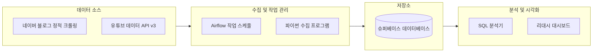

# 3. 아키텍처 및 엔지니어링

## 3.1 시스템 구성도
데이터 수집부터 시각화까지 전체적인 파이프라인 흐름을 도식화한 구조입니다.

---

## 3.2 기술 스택 및 선정 이유

| 분류 | 도구 | 선정 이유 |
| :--- | :--- | :--- |
| **작업 관리** | **아파치 에어플로우(Airflow)** | 데이터 수집 일정 관리 및 자동화, 오류 발생 시 자동 재시도를 지원하여 파이프라인 안정성을 높이기 위해 선정 |
| **개발 언어** | **파이썬(Python)** | 네이버, 유튜브 등 외부 API 활용 및 데이터 분석 라이브러리 제공으로 개발 속도가 빠름 |
| **데이터베이스** | **슈퍼베이스(Supabase)** | 서버 관리 부담이 적은 클라우드 환경에서 구축하고 팀을 초대해 같은 데이터 베이스를 볼수있도록 제공해주어 팀간에 데이터 공유가 쉽고 관리가 쉬워 채택 |
| **시각화** | **리대시(Redash)** | SQL 쿼리만으로 실시간 데이터를 차트로 만들기 쉬우며, 클라우드 환경에 환경을 구축하여 사용 가능 |

---

## 3.3 데이터 흐름

### 1단계: 수집 (Collection)
- **네이버 API**: '두바이 쫀득 쿠키' 및 과거 유행 상품(포켓몬빵, 마라탕 등)의 일별 포스팅 업로드 양을 추출.
- **유튜브 API**: 특정 검색어와 관련된 동영상 개수, 조회수, 좋아요, 댓글 등의 수치 데이터를 수집.
- **실시간 업데이트**: 에어플로우를 통해 데이터 저장 시 갱신되는 데이터에 대해 업데이트를 할수있도록 쿼리로직에 덮어쓰기 로직을 추가하여 구현
- **

### 2단계: 저장 (Storage)
- 수집된 원본 데이터는 **슈퍼베이스(Supabase)**의 정형 테이블에 저장.
- 날짜와 키워드를 기준으로 인덱스(색인)를 설정하여 대량의 데이터도 빠르게 조회할 수 있도록 구성.

### 3단계: 처리 (Processing)
- **변환 및 가공**: 파이썬으로 수집된 원시 데이터를 데이터베이스에서 분석하기 좋은 형태로 변환.
- **지표 산출**: SQL 쿼리를 활용해 '관심도 지수'나 '전월 대비 성장률' 등 실제 분석에 필요한 핵심 지표를 계산.

### 4단계: 분석 및 시각화 (Analysis/Visualization)
- **대시보드 구축**: 가공된 데이터를 바탕으로 리대시에서 과거 유행에 대한 비교 차트 ,  두바이 쫀득 쿠키의 관심도(일별 블로그 포스팅 수 , 유투브 조회수 , 좋아요 수 , 댓글 수) 시각화 결과물을 생성.

- **최종 결과**: 과거 유행 사례의 성장/쇠퇴 패턴과 현재 두바이 쿠키의 데이터를 대조하여, 시장 성숙도와 향후 전망에 대한 인사이트를 도출.
