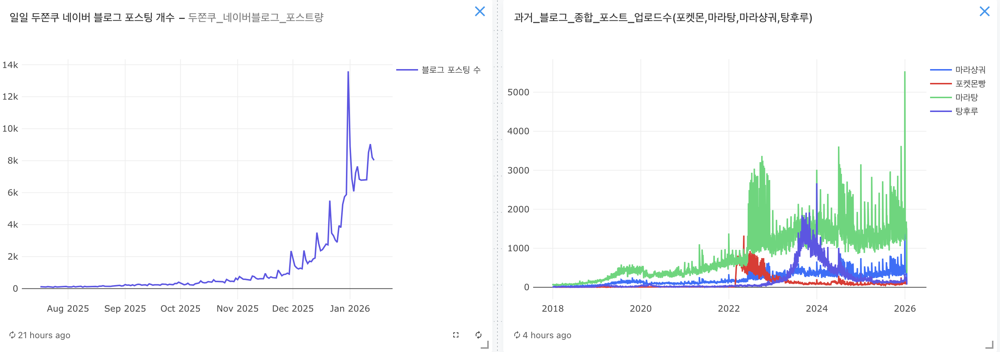
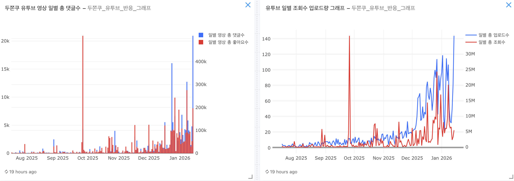

# 4. 데이터 분석 및 핵심 기능 (Analysis & Features)

## 4.1 핵심 발견 1: 두바이 쫀득 쿠키(두쫀쿠) 가격 전략 및 수익성 인사이트
재료비와 인건비 분석을 통해 산출된 적정 판매가 및 수익 가이드라인입니다.

### [원가 분석 결과]
- **개당 총 원가**: **약 6,125원 ~ 6,625원**
  - **재료비**: 약 4,125원 (피스타치오 약 122% 상승 반영)
  - **인건비**: 약 2,000원 ~ 2,500원 (6단계의 복잡한 공정 포함)
- **임계점**: 판매가가 8,000원 미만일 경우 고정비(카페 유지비) 제외 시에도 마진이 매우 낮거나 적자가 발생할 위험이 큼.

### [판매 전략 및 수익성 진단]
| 판매가 | 마진율 | 현실성 및 판단 | 권장 전략 |
| :---: | :---: | :--- | :--- |
| **8,000원** | 낮음 | 월 2,134개 판매 필요 (하루 86개) | 초기 진입 시 공격적인 홍보용 가격 |
| **9,000원** | **안정적** | 월 1,392개 판매 필요 (하루 56개) | **가장 현실적인 도전 가능 가격** |
| **10,000원** | **최고** | 월 1,033개 판매 필요 (하루 42개) | 프리미엄 포지셔닝 및 수익 극대화 전략 |

---

## 4.2 핵심 발견 2: 트렌드 지속성 분석
*(이 항목은 데이터 업데이트 후 추가 분석 예정이며, 현재 수집된 지표의 특징은 다음과 같습니다.)*

- **네이버 블로그 포스팅 추이**: 과거 유행 사례(포켓몬빵, 탕후루)와 현재 두쫀쿠의 포스팅 빈도를 비교 분석.

- **유튜브 관심도 지표**: 두바이 쿠키 관련 영상의 조회수, 좋아요, 댓글 참여도를 통한 트렌드 성숙도 진단.

---

## 4.3 분석 데이터 근거 및 시장 사례
트렌드의 지속성 및 바이럴 효과를 뒷받침하는 데이터 근거 자료입니다.

### A. 스테디 트렌드 및 바이럴 사례
- **마라탕 사례**: 일시적 유행을 넘어 하나의 식사 카테고리로 안착한 배경 분석.

[관련 기사 보기](https://www.srtimes.kr/news/articleView.html?idxno=183665)

- **안성재 쉐프 유튜브 바이럴**: 업로드 15일 만에 500만 뷰를 돌파하며 강력한 대중적 관심도 증명.

[관련 기사 보기](https://www.edaily.co.kr/News/Read?newsId=02650246645318376&mediaCodeNo=257)

### B. 시장 확장성 및 변형 상품 등장
- **다양한 형태의 상품화**: 김밥, 케이크, 찐빵 등 타 카테고리로의 변형을 통한 유행 지속력 확보.

[관련 기사 보기](https://www.newsis.com/view/NISX20260113_0003474578)

- **타 업종 진입**: 베이커리를 넘어 다양한 채널에서 광고 및 집객용 상품으로 활용 중.

[관련 기사 보기](https://www.munhwa.com/article/11560229?ref=naver)

---

## 4.4 비즈니스 임팩트: 소상공인을 위한 인사이트
데이터 분석 결과에 기반한 실전 판매 전략입니다.

1.  **프리미엄 가격 정책 필수**: 원재료값(피스타치오) 폭등 상황에서는 저가 경쟁보다 9,000원~10,000원대의 **프리미엄 포지셔닝**을 통해 안정적인 마진을 확보해야 생존 가능함.
2.  **바이럴 효과를 활용한 단기 집중**: 안성재 쉐프 사례와 같은 대형 바이럴 시점에 집중적으로 노출을 강화하여 초기 목표 판매량(하루 40~50개)을 달성하는 것이 중요.
3.  **변형 메뉴를 통한 차별화**: 단순 쿠키를 넘어 케이크나 찐빵 등 **독특한 변형 상품 조합**을 통해 '반짝 유행' 이미지를 탈피하고 고객의 호기심을 지속적으로 자극해야 함.
4.  **시장 경제 효과 기대**: 두쫀쿠 유행은 개별 점포의 매출뿐만 아니라 전체 소상공인 시장의 활력을 불어넣는 촉매제로 활용 가능함.

[관련 기사 보기](https://magazine.hankyung.com/business/article/202601151496b)
