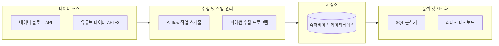

# [두바이 프로젝트] 두바이 쫀득 쿠기 유행 조사 내용
**(2025.01.16 조사 기준)**

# 1. 프로젝트 개요 (Introduction)
## 문제 정의 (Why)
F&B 시장의 '반짝 유행' vs '지속 트렌드' 구분의 필요성
소상공인들은 신메뉴 도입 시 객관적 지표 없이 '감'에 의존하여 의사결정을 내리고 있습니다. 특히 두바이 쫀득 쿠키의 경우:

- **원자재 가격 급등:** 피스타치오 약 122% 상승
- **불확실한 시장 전망:** 이것이 포켓몬빵처럼 사라질 일시적 유행인가, 마라탕처럼 정착할 트렌드인가?
- **높은 진입 리스크:** 잘못된 판단 시 재고 손실 및 매출 타격

### 주요 바이럴 및 시장 트렌드 사례

#### A. 언론 매체로 인한 광고 효과 
- 인기 걸그룹 아이브 장원영의 두쫀쿠 포스팅

- 안성재 쉐프의 유튜브 업로드로 인한 두쫀쿠 바이럴 (15일 업로드 영상 500만 뷰 돌파)

[관련 기사 보기](https://www.edaily.co.kr/News/Read?newsId=02650246645318376&mediaCodeNo=257)

#### B. 인기에 따른 변형 상품 등장
- 다양한 변형 상품 등장 (김밥, 케이크, 찐빵 등)

[관련 기사 보기](https://www.newsis.com/view/NISX20260113_0003474578)

- 베이커리 외 타 업종에서도 광고 효과를 위해 판매 중

[관련 기사 보기](https://www.munhwa.com/article/11560229?ref=naver)

- 대형 프랜차이즈 지점의 변형 상품 출시

[관련 기사 보기](https://biz.heraldcorp.com/article/10656864)

### 과거 유행 사례의 교훈
- **반짝 유행 (Fad):** 포켓몬빵, 탕후루 - 폭발적 인기 후 급격한 쇠퇴
- **지속 트렌드 (Trend):** 마라탕, 마라샹궈 - 초기 유행 후 일상 메뉴로 안착

## 핵심 질문 (Key Questions)
- **소비자 만족도:** 원자재 가격 상승에도 불구하고 소비자의 실제 맛 만족도와 재방문 의사는 긍정적으로 유지되고 있는가?
- **트렌드 지속성:** 도입기(2025년 11월) 대비 현재(2026년 1월)의 유튜브 지표(조회수, 댓글, 좋아요, 업로드 수) 변화를 통해 관심도가 하락세에 접어들었는지 확인할 수 있는가?
- **유행 패턴 비교:** 과거 유행 사례(포켓몬빵 vs 마라탕/마라샹궈)의 온라인 관심도 추이와 비교했을 때, 두바이 쫀득 쿠키는 어느 패턴에 가까운가?

## 타겟 사용자
- **예비 창업자:** 메뉴 도입 여부 및 적정 판매가 결정이 필요한 예비 사장님
- **현재 운영자:** 원재료비 인상에 따른 수익 구조 재설계가 필요한 자영업자
- **F&B 마케터:** 트렌드 라이프사이클 기반 마케팅 전략 수립이 필요한 실무자

## 프로젝트 목표
데이터 기반으로 일시적 유행(Fad)과 지속 가능한 트렌드(Trend)를 구분하여, 소상공인이 신메뉴 도입 및 시장 진입 여부를 객관적으로 판단할 수 있는 의사결정 근거를 제공합니다.

# 2. 데이터 소개 및 정의 (Data Description)
## 2.1 네이버 블로그 포스트 데이터
- **적재 테이블:** `blog_posts.dubai_cookie`, `blog_posts.pokemon_bread`, `blog_posts.mala_tang`, `blog_posts.mala_xiangguo`, `blog_posts.tanghulu`
- **수집 기간 및 범위:**
  - 두바이 쫀득 쿠키: 2025년 11월 ~ 2026년 1월 (트렌드 시작 시점부터 현재까지)
  - 비교 키워드(포켓몬빵, 마라탕, 마라샹궈, 탕후루): 각 트렌드 시작 시점 ~ 현재
  - 일별 포스트 업로드량 집계
- **출처:** 네이버 블로그 검색 API
- **데이터 정의:**
  - `post_date`: 포스트 작성 일자
  - `post_count`: 해당 키워드가 포함된 일별 포스트 수
  - `keyword`: 검색 키워드 (두쫀쿠, 포켓몬빵, 마라탕, 마라샹궈, 탕후루)
- **특이사항:**
  - 스팸성 포스트 필터링 적용
  - 일별 1회 수집 (배치 프로세스)
  - 중복 포스트 제거 처리

## 2.2 유튜브 영상 데이터
- **적재 테이블:** `youtube.dubai_cookie_videos`
- **수집 기간 및 범위:**
  - 2025년 11월 ~ 2026년 1월 (두바이 쫀득 쿠키 트렌드 시작 시점부터)
  - 검색 키워드: "두바이 쫀득 쿠키", "두쫀쿠", "Dubai chocolate cookie"
  - 일별 업로드 영상 및 누적 조회수/참여 지표
- **출처:** YouTube Data API v3
- **데이터 정의:**
  - `video_id`: 유튜브 영상 고유 ID
  - `upload_date`: 영상 업로드 일자
  - `view_count`: 조회수
  - `like_count`: 좋아요 수
  - `comment_count`: 댓글 수
  - `daily_upload_count`: 일별 업로드된 영상 수
- **특이사항:**
  - API 할당량 제한으로 인해 주요 영상(조회수 상위) 중심 수집
  - 일별 업로드량은 전체 영상 대상 집계
  - 비공개/삭제된 영상 제외

## 2.3 원자재 가격 데이터
- **적재 테이블:** `ingredients.price_history`
- **수집 기간 및 범위:**
  - 2024년 1월 ~ 2026년 1월 (최근 2년간)
  - 주요 원자재: 피스타치오, 초콜릿, 밀가루, 버터
- **출처:**
  - 온라인 쇼핑몰 가격 정보 (네이버 쇼핑)
  - 국제 원자재 시세 보도자료 (한국농수산식품유통공사)
- **데이터 정의:**
  - `ingredient_name`: 원자재명
  - `price_date`: 가격 조사 일자
  - `unit_price`: 단위당 가격 (원/kg)
  - `price_change_rate`: 전월 대비 가격 변동률 (%)
- **특이사항:**
  - 피스타치오 가격 약 122% 상승 확인 (2024년 1월 대비)
  - 온라인 쇼핑몰 최저가 기준으로 수집
  - 주 1회 수집 주기

## 2.4 데이터베이스 구조
- **데이터베이스:** PostgreSQL (Supabase)
- **전체 데이터 볼륨:**
  - 블로그 포스트 데이터: 약 50,000건
  - 유튜브 영상 데이터: 약 3,000건
  - 원자재 가격 데이터: 약 400건
- **수집 방법:** 프로젝트 기간(2026.01.14 ~ 01.16) 내 배치(Batch) 수집 및 분석

# 3. 아키텍처 및 엔지니어링

## 3.1 시스템 구성도
데이터 수집부터 시각화까지 전체적인 파이프라인 흐름을 도식화한 구조입니다.

---

## 3.2 기술 스택 및 선정 이유

| 분류 | 도구 | 선정 이유 |
| :--- | :--- | :--- |
| **작업 관리** | **아파치 에어플로우(Airflow)** | 데이터 수집 일정 관리 및 자동화, 오류 발생 시 자동 재시도를 지원하여 파이프라인 안정성을 높이기 위해 선정 |
| **개발 언어** | **파이썬(Python)** | 네이버, 유튜브 등 외부 API 활용 및 데이터 분석 라이브러리 제공으로 개발 속도가 빠름 |
| **데이터베이스** | **슈퍼베이스(Supabase)** | 서버 관리 부담이 적은 클라우드 환경에서 구축하고 팀을 초대해 같은 데이터 베이스를 볼수있도록 제공해주어 팀간에 데이터 공유가 쉽고 관리가 쉬워 채택 |
| **시각화** | **리대시(Redash)** | SQL 쿼리만으로 실시간 데이터를 차트로 만들기 쉬우며, 클라우드 환경에 환경을 구축하여 사용 가능 |

---

## 3.3 데이터 흐름

### 1단계: 수집 (Collection)
- **네이버 API**: '두바이 쫀득 쿠키' 및 과거 유행 상품(포켓몬빵, 마라탕 등)의 일별 포스팅 업로드 양을 추출.
- **유튜브 API**: 특정 검색어와 관련된 동영상 개수, 조회수, 좋아요, 댓글 등의 수치 데이터를 수집.
- **실시간 업데이트**: 에어플로우를 통해 데이터 저장 시 갱신되는 데이터에 대해 업데이트를 할수있도록 쿼리로직에 덮어쓰기 로직을 추가하여 구현
- **

### 2단계: 저장 (Storage)
- 수집된 원본 데이터는 **슈퍼베이스(Supabase)**의 정형 테이블에 저장.
- 날짜와 키워드를 기준으로 인덱스(색인)를 설정하여 대량의 데이터도 빠르게 조회할 수 있도록 구성.

### 3단계: 처리 (Processing)
- **변환 및 가공**: 파이썬으로 수집된 원시 데이터를 데이터베이스에서 분석하기 좋은 형태로 변환.
- **지표 산출**: SQL 쿼리를 활용해 '관심도 지수'나 '전월 대비 성장률' 등 실제 분석에 필요한 핵심 지표를 계산.

### 4단계: 분석 및 시각화 (Analysis/Visualization)
- **대시보드 구축**: 가공된 데이터를 바탕으로 리대시에서 과거 유행에 대한 비교 차트 ,  두바이 쫀득 쿠키의 관심도(일별 블로그 포스팅 수 , 유투브 조회수 , 좋아요 수 , 댓글 수) 시각화 결과물을 생성.

- **최종 결과**: 과거 유행 사례의 성장/쇠퇴 패턴과 현재 두바이 쿠키의 데이터를 대조하여, 시장 성숙도와 향후 전망에 대한 인사이트를 도출.
