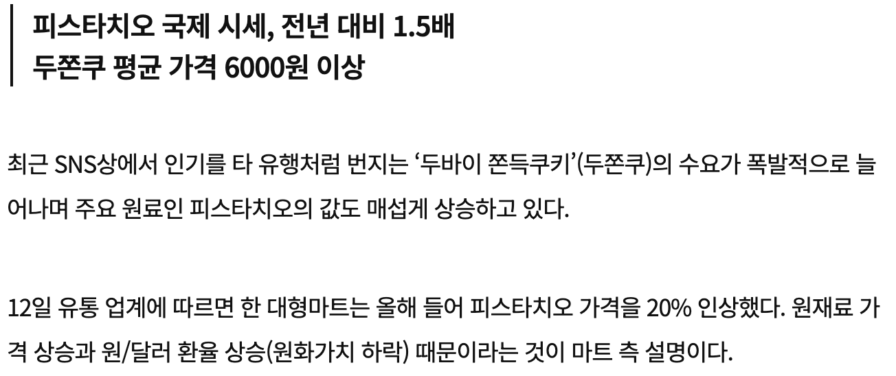
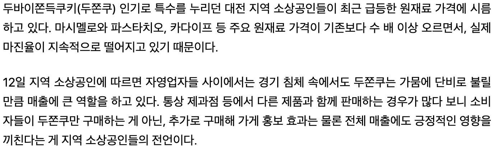

# [두바이 프로젝트] 문제 분석안
**(2025.01.15 조사 기준)**

---

## 1. 주요 원재료 구성
*   피스타치오 스프레드
*   카다이프
*   마시멜로
*   탈지분유
*   코코아 파우더
*   무염버터
*   화이트 초콜릿

---

## 2. 시장 가격 및 판매량 변화 (쿠팡 기준)
*(두쫀쿠 관련 메인 재료 위주 검색; 마시멜로, 탈지분유, 코코아 파우더는 다른 베이킹에 사용되는 공통 재료이므로 생략)*

### ■ 피스타치오 스프레드 가격 변화 (200g 기준)
| 구분 | 10월 | 11월 | 12월 | 1월 |
|:---:|:---|:---|:---|:---|
| **제품 1** | 24,900원 (평균 86개 판매) | 24,900원 (평균 86개 판매) | 31,900원 (평균 93개 판매) | 31,900원 (평균 118개 판매) |
| **제품 2** | 23,490원 (평균 101개 판매) | 22,900원 (평균 105개 판매) | 32,400원 (평균 127개 판매) | 30,650원 (평균 192개 판매) |
| **제품 3** | 27,700원 (구매 없음) | 27,800원 (평균 15개 판매) | 27,800원 (평균 31개 판매) | 25,800원 (평균 50개 판매) |

### ■ 카다이프 가격 변화 (12월 ~ 1월 대비)
*   **(200g)**: 8,490원 (57개 구매) → **12,500원 (136개 구매)**
*   **(150g)**: 7,500원 (구매 없음) → **18,000원 (15개 구매)**
*   **(500g)**: 30,000원 (70개 구매) → **39,000원 (72개 구매)**

---

## 3. 원재료 가격 조사 (1g당 단가 산출)
*   **피스타치오 스프레드 (200g)**: 30,650원 (1g당 153.25원)
    [출처: 쿠팡](https://www.coupang.com/vp/products/8224998636?itemId=23652986450&vendorItemId=90678357039&pickType=COU_PICK&q=%ED%94%BC%EC%8A%A4%ED%83%80%EC%B9%98%EC%98%A4%EC%8A%A4%ED%94%84%EB%A0%88%EB%93%9C&searchId=e0f61cda3054874&sourceType=search&itemsCount=36&searchRank=0&rank=0&traceId=mkezng78)
*   **카다이프 (200g)**: 12,500원 (1g당 62.5원)
    [출처: 쿠팡](https://www.coupang.com/vp/products/8230464079?itemId=27415630812&vendorItemId=94381205581&q=%EC%B9%B4%EB%8B%A4%EC%9D%B4%ED%94%84%20200g&searchId=3a7aa7753050715&sourceType=search&itemsCount=36&searchRank=0&rank=0&traceId=mkezmrdv)
*   **마시멜로 (1kg)**: 17,000원 (1g당 17원)  
    [출처: 만월회](https://www.manwol.biz/bakery/?idx=1266)
*   **탈지분유 (1kg)**: 19,600원 (1g당 약 19.6원 ~ 20원)  
    [출처: 베이킹몬](https://bakingmon.com/product/detail.html?product_no=349)
*   **카카오 파우더 (500g)**: 17,480원 (1g당 약 34.96원 ~ 35원)  
    [출처: 베이킹몬](https://bakingmon.com/product/detail.html?product_no=19315)
*   **무염버터 (400g)**: 9,000원 (1g당 22.5원)  
    [출처: 오아시스](https://m.oasis.co.kr/product/detail/50837)
*   **화이트 초콜릿 (1kg)**: 26,000원 (1g당 26원)  
    [출처: 차별화](https://www.chabyulhwa.com/products/5113445)

---

## 4. 두쫀쿠 1개당 소요 원가 분석 (1번 재료 기준)
*(로스율 미포함: 재료 누출 및 손실률 제외)*

*   **피스타치오 스프레드 (20g)**: 3,065원 (1월 가격 30,650원 / 200g 기준)
*   **카다이프 (10g)**: 625원 (1월 가격 12,500원 / 200g 기준)
*   **마시멜로 (12g)**: 204원
*   **화이트 초콜릿 (4g)**: 104원
*   **무염버터 (3g)**: 약 68원
*   **탈지분유 (0.7g)**: 약 14원
*   **카카오 파우더 (1.3g)**: 약 45원
*   **[합계] 개당 재료비**: **약 4,125원**

### [공정 단계 및 인건비]
*   **적정 인건비**: 약 2,000원 ~ 2,500원
*   **작업 과정**:
    1. 카다이프 볶기
    2. 피스타치오 속 만들기 및 냉동
    3. 마시멜로 녹이기
    4. 두쫀쿠 만들기
    5. 코코아 파우더 묻히기
    6. 냉동 및 포장

---

## 5. 판매가 설정 및 마진 분석
*(카페 유지비: 월 약 300만 원 / 재료비 4,125원, 인건비 2,000원 고정 시)*

| 판매가 | 재료비 비중 | 인건비 비중 | 예상 마진 | 결과 분석 |
|:---:|:---:|:---:|:---:|:---:|
| **5,000원** | 82.5% | 40.0% | -1,125원 | **적자** |
| **6,000원** | 68.8% | 33.3% | -125원 | **적자** |
| **7,000원** | 58.9% | 28.6% | 875원 | **매우 낮음** |
| **8,000원** | 51.6% | 25.0% | 1,875원 | **보통** |
| **9,000원** | 45.8% | 22.2% | 2,875원 | **안정적 마진** |
| **10,000원** | 41.3% | 20.0% | 3,875원 | **최고 수익성** |

---

## 6. 목표 판매량 및 현실성 검토
*(순수익 100만 원 확보를 목표로 할 때)*

*   **산출식**: 고정비 / 개당 마진 = 목표 판매 개수
*   목표 개수 초과분부터 사장의 순이익으로 전환됩니다.

| 판매가 | 개당 마진 | 월 목표 판매량 | 하루 목표 | 현실성 및 판단 |
|:---:|:---:|:---:|:---:|:---|
| **5,000원** | -1,125원 | - | - | **팔수록 손해** |
| **6,000원** | -125원 | - | - | **적자 발생** |
| **7,000원** | 875원 | 4,572개 | 183개 | **불가능 수준** |
| **8,000원** | 1,875원 | 2,134개 | 86개 | **매우 힘듦** (직원 필수) |
| **9,000원** | 2,875원 | 1,392개 | 56개 | **도전 가능** |
| **10,000원** | 3,875원 | 1,033개 | 42개 | **수익성 최고** |

원재료 값 상승에 대한 기사

https://www.munhwa.com/article/11560062

https://v.daum.net/v/KuHjM4Kpsu?f=p