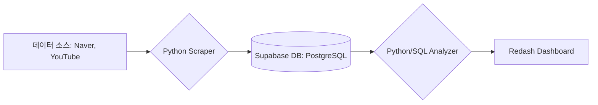

# 자유 주제 캡스톤 프로젝트 주제 선정안

## 1. 프로젝트 기본 정보

*   **프로젝트명**: 두바이 쫀득 쿠키의 시장성과 수익성을 분석하기 위한 데이터 기반 비즈니스 인사이트 도출
*   **팀원**: 박지원, 배승재
*   **진행 기간**: 2026년 1월 14일(수) ~ 1월 16일(금) (3일)

---

## 2. 문제 정의 (Why)

### 과거 유행 사례의 교훈
'대만 카스테라', '벌집 아이스크림', 그리고 최근의 '탕후루'까지, F&B 시장은 폭발적인 유행 뒤에 급격한 쇠퇴가 뒤따르는 **'반짝 유행'**의 역사를 반복해옴. 
*   **탕후루 사례**: 2023년 한 해 동안 전국 매장 수가 급증했으나, 1년도 채 되지 않아 폐업 신고가 속출하며 소상공인들의 막대한 자산 손실을 초래.
*   **공통점**: 재료비가 비싸 남는 게 적고, 비슷한 가게들이 한꺼번에 너무 많이 생겨나며, 손님들의 호기심이 순식간에 식어버리는 공통적인 하락 과정을 겪음.
*   **차별점**: 본 프로젝트는 '두바이 쫀득 쿠키'가 위 사례들처럼 급격한 몰락의 길을 걷고 있는지, 아니면 안정적인 디저트 카테고리로 안착할 수 있는지를 데이터(유튜브 관심도 감쇠 지표 등)로 선제적으로 포착하고자 함.

### 해결하고자 하는 문제
원자재값 폭등(피스타치오 약 122%↑) 상황에서 객관적인 지표 없이 '감'에 의존한 메뉴 도입 및 가격 책정으로 인해 발생하는 소상공인의 경영 리스크 해결.

### 중요성 및 목적
소상공인의 생존율과 직결되는 핵심 원가 리스크를 관리하고, 일시적인 유행(Fad)과 지속 가능한 트렌드(Trend)를 구분할 수 있는 데이터 기반의 의사결정 근거를 마련함.

### 타겟 사용자
*   **예비 창업자**: 메뉴 도입 여부 및 적정 판매가를 고민 중인 예비 사장님.
*   **현재 운영자**: 인상된 원재료비에 맞춰 수익 구조를 재설계하려는 자영업자.

### 핵심 질문 (Key Questions)
1. 원자재 쇼크에도 불구하고 소비자의 실제 맛 만족도와 재방문 의사는 긍정적으로 유지되고 있는가?
2. 유튜브 도입기(25년 11월) 대비 현재(26년 1월)의 댓글 반응을 통해 트렌드가 하락세에 접어들었는지 판단할 수 있는가?
3. 과거 업로드 된 두쫀쿠 영상에 대한 현재의 댓글 유입률을 통해 유행 종료 시점을 예측할 수 있는가?

---

## 3. 데이터 소스 (Data Sources)

*   **수집 출처**: 네이버 블로그 검색 API, 유튜브 데이터 API (v3), 국제 원자재 시세 보도자료.
*   **수집 주기**: 프로젝트 기간 내 배치(Batch) 수집 및 시계열 분석.
*   **데이터 볼륨**: 네이버 블로그 서울 25개 구 데이터 300건 이상, 유튜브 시기별 인기 영상 댓글 데이터.
*   **파일 형식**: JSON, PostgreSQL (Supabase), CSV.

---

## 4. 아키텍처 설계

### 데이터 파이프라인

### 분석 로직 상세
*   **Scraper**: `requests`, `google-api-python-client`를 활용하여 두쫀쿠 관련 블로그 및 유튜브 데이터 수집.
*   **Analyzer**: 정규표현식 기반의 로컬 감성 분석 엔진 및 유튜브 '관심도 감쇠 지표(Decay Rate)' 산출 로직 구축.
*   **DB 구조**: `blog_review`, `youtube_comments`, `review_analysis_result` 테이블 운영 (정수형 가격 데이터 포함).

---

## 5. 구현 체크리스트

### Day 1 (수) - 기초 구축
- [ ] 문제 정의 및 데이터 소스 확정
- [ ] 네이버 블로그 수집기 구현 및 300건 수집 완료
- [ ] Supabase 기본 테이블 설계 및 연동

### Day 2 (목) - 고도화 및 분석
- [ ] YouTube Data API 연동 및 시계열 수집기 (`youtube_scraper.py`) 개발 완료
- [ ] 로컬 정밀 분석기 (가격 추출 및 감성 분석) 고도화 완료
- [ ] 데이터 수집 자동화 및 대량 적재

### Day 3 (금) - 시각화 및 리포트
- [ ] Redash 대시보드 구축 및 DB 연동
- [ ] 최종 비즈니스 인사이트 도출 및 문서화
- [ ] 발표 자료 및 결과 리포트 준비

---

## 6. 예상 결과물

### 대시보드 및 리포트
*   **시각화**: 유튜브 핵심 키워드 감성 변화 추이 및 관심도 감쇠 차트.
*   **인사이트**: 원가 상승률 대비 적정 판매가 가이드라인 및 시장 하락 신호 포착 로직 제공.

### 비즈니스 임팩트
감에 의존한 무분별한 유행성 창업을 방지하고, 데이터에 기반한 합리적인 시장 진입 및 후퇴 시점에 대한 가이드라인을 제시함으로써 소상공인의 실질적 자산 손실 최소화에 기여함.

[뉴스 출처]
https://www.eyesmag.com/posts/163456/dubai-chewy-cookie
https://www.ytn.co.kr/_ln/0134_202601120825005601
https://www.yna.co.kr/view/AKR20260111000900030
https://economist.co.kr/article/view/ecn202601130032